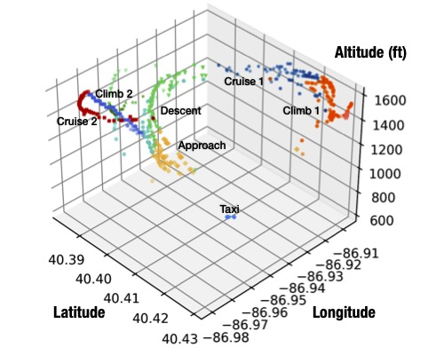
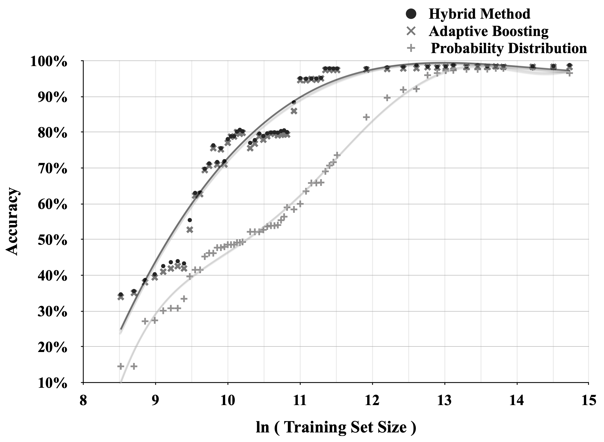
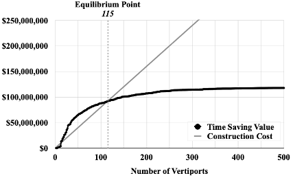
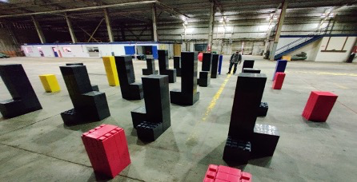

<!-- ## Published Papers -->

<h2> Published Papers </h2>

  <strong>[1]</strong>
  

      <h3>Development of a Reliable Method for General Aviation Flight Phase Identification</h3>

      
<strong>Journal:</strong> <em> IEEE Transactions on Intelligent Transportation Systems </em>, Vol 23, No. 8, Page 11729-11738, Aug 2022

      
<strong>Authors:</strong>  <u> Qilei Zhang </u>, John H. Mott, Mary E. Johnson, John A. Springer

      
<strong>Notes:</strong> Article named <em> Identifying flight phase times to predict harmful emissions, noise pollution</em> written by by Melissa Templeton on November 09, 2021. <a href="https://polytechnic.purdue.edu/newsroom/identifying-flight-phase-times-predict-harmful-emissions-noise-pollution"> Link to News </a> 

      <a href="https://doi.org/10.1109/TITS.2021.3106774"><button class="pdf-button">PDF</button></a>
      <button class="pdf-button collapsible">Abstract</button>
      

        
Aircraft operations statistics have typically received significant attention from U.S. airport owners and operators and state, local, and federal agencies. Accurate operational data is beneficial in assessing airports’ performance efficiency and impact on the environment, but operational statistics at nontowered general aviation airports are, for the most part, limited or not available. However, the increasing availability and economy of capturing and processing Automatic Dependent Surveillance-Broadcast (ADS-B) data shows promise for improving accessibility to a wide variety of information about the aircraft operating in the vicinity of these airports. Using machine learning technology, specific operational details can be decoded from ADS-B data. This paper aims to develop a reliable and economical method for general aviation aircraft flight phase identification, thereby leading to improved noise and emissions models, which are foundational to addressing many public concerns related to airports.

      

  

  

      
  

  <strong>[2]</strong>
  

      
      <h3>An Improved Framework for Classification of Flight Phases of General Aviation Aircraft</h3>

      
<strong>Journal:</strong> <em> Transportation Research Record </em>, 2677(3), 1665-1675. 

      
<strong>Authors:</strong>  <u>Qilei Zhang</u>, John H. Mott

      
<strong>Notes:</strong>  Invited to present in Transportation Research Board 2021, D.C. 

      <a href="https://doi.org/10.1177/03611981221127016"><button class="pdf-button">PDF</button></a>
      <button class="pdf-button collapsible">Abstract</button>
      

        
Flight data mining enables airport owners, operators, and governmental entities to explore more intelligent management strategies; in particular, cost-effectively obtaining accurate operational data is beneficial for general aviation (GA) airports and their associated communities. The current data collection modus operandi, however, does not meet future needs, as aircraft operations are counted manually or estimated by sampling methods. The increasing traffic flow and limited available personnel at most GA airports make it unrealistic to continue using traditional methods to analyze aircraft operational statistics; therefore, a customized approach is needed to address this problem. Since different flight phases have different levels and types of impact on the environment, acquiring information related to the duration of each flight phase at the airport and within its surrounding airspace is critical to the assessment of emissions and noise pollution from aircraft. The primary goal of the research is to provide quantified inputs for the environmental evaluation model, such as the Aviation Environmental Design Tool (AEDT). This paper demonstrates a programmed framework that successfully achieves satisfactory performance in solving flight phase identification problems by testing the synthetic flight data as well as validating the empirical Automatic Dependent Surveillance-Broadcast (ADS-B) data. The experimental results suggest that the proposed methods achieve promising classification accuracy, leading to feasible deployment in airport operations.

      

  

  

      
  

  <strong>[3]</strong>
  

      
      <h3>Urban Air Mobility Network Distribution in Chicago Metropolitan Area</h3>

      
<strong>Conference:</strong> <em> 2023 AIAA Aviation Forum </em>, San Diego, California

      
<strong>Authors:</strong> <u>Qilei Zhang</u>, John H. Mott

      
<strong>Notes:</strong> 2023 AIAA Best Student Paper Award in Air Transportation Systems <em> Runner-up </em> 

      <a href="https://doi.org/10.2514/6.2023-3262"><button class="pdf-button">PDF</button></a>
      <button class="pdf-button collapsible">Abstract</button>
      

        
Urban Air Mobility (UAM) concepts have received significant attention in recent years. The new technology accompanying this concept aims to provide another possibility of daily transport and reduce the pressure of traffic congestion and environmental pollution. The potential demand within a specific range needs to be analyzed to probe the placement and desired number of vertiports, thereby maximizing the benefits UAM operations bring. This paper investigates the feasible distribution of vertiports for UAM operations by considering the commuting demand in the Chicago metropolitan area for this new air transportation service. The problem of the optimal number of vertiports is explored, and the results demonstrate how competitive the UAM network is in time savings compared to commuting by driving. The applied techniques quantify the benefit brought by UAM and assist in providing a solid forecast for UAM stakeholders in understanding the prospective market for this new air transportation.

      

  

  

      
  

  <strong>[4]</strong>
  

      
      <h3>Research Infrastructure for Real-time Computer Vision Applications in Unmanned Aerial Systems</h3>

      
<strong>Conference:</strong> <em>2022 IEEE International Conference on Intelligent Transportation Engineering </em>

      
<strong>Authors:</strong>  Luigi Raphael I Dy, Kristoffer B Borgen, <u>Qilei Zhang</u>, John H. Mott 

      <!-- 
<strong>Notes:</strong>  Best Student Paper Award in Air Transportation Systems 
 -->

      <a href="https://doi.org/10.1109/ICITE56321.2022.10101390"><button class="pdf-button">PDF</button></a>
      <button class="pdf-button collapsible">Abstract</button>
      

        
As the use and applications of Unmanned Aerial Systems (UAS) grow, the need for rapid and efficient research and development arises. UAS aspects such as sensing, navigation, and collision avoidance need to be evaluated. To facilitate this, research infrastructure comprising a simulator and a sizeable indoor testing center has been proposed and built. The discussed infrastructure aims to boost research progress with a focus on low-power computer vision solutions for UAS applications. This research and development process optimizes available resources by eliminating suboptimal solutions early. Leveraging a motion capture system, precise and accurate metrics can be used to evaluate and compare competing solutions prior to real-world testing. Additionally, various scenarios and environments can be recreated at relatively low cost in simulation or indoors, providing researchers with rigorous testing opportunities. Competitions are currently held to pit teams from around the world to produce effective solutions for UAS tasks. Beginning with simple problems, tasks of increasing complexity will be introduced commensurate with previous successes. While it is acknowledged that simulation and indoor testing cannot completely replace real-world testing, this infrastructure setup provides an invaluable opportunity for UAS researchers.

      

  

  

      
  

