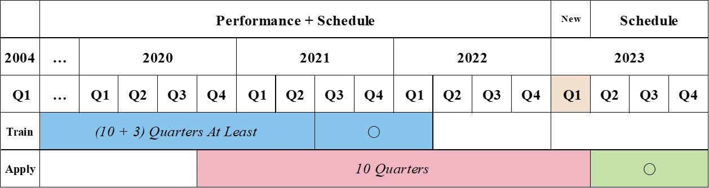

<!-- # Alpha Market Seat Allocation Forecasting Using RNNs -->
## Introduction
This project focuses on predicting the number of seats likely to be arranged for a given airline route in specified future quarters. The prediction model is built around Recurrent Neural Networks (RNN), which have shown effectiveness in dealing with sequential data. The historical dataset used for training the model has been sourced from Diio Mi, which consists of details related to airline performance and future schedules.

## Model Training
To train the model, follow these steps:

1. **Data Preparation**: 
   - Download the necessary data from Diio Mi and place it in the data folder. The data should encompass airline performance information from previous quarters as well as the scheduled data for the upcoming quarters. The specific files to be downloaded are:
     - `Schedule_Monthly_Summary_Report_Conti.csv`: This file contains historical data on quarterly airline schedules.
     - `Airline_Performance_Report_Conti.csv`: This file provides an overview of the airline's performance in past quarters.
     - `Schedule_Monthly_Summary_2023Qxxxx.csv`: This file provides scheduled data for the quarters of 202x.

2. **Code Setup**:
   - Organize the code files in a dedicated folder. This could be a local directory on your machine, a folder in Google Colab, or a workspace in Azure Databricks. The required files are:
     - `RNN_model.py`: This is the main script where the RNN model is defined and trained.
     - `RNN_apply_ind.py`: This script is used to apply the trained model for testing data predictions.
     - `parameters.json`: This file contains configurable parameters for the model.

3. **Parameter Adjustment**: 
   - Modify the parameters in the `parameters.json` file as per your requirement. This allows you to fine-tune various aspects of the model like the number of layers, learning rate, number of epochs, etc.

## Shortcut Tasks

The `run.ipynb` notebook contains quick steps for performing various tasks. These tasks include:
- Data Validation: Testing the latest quarters' data against settled schedule data.
- Data Update: Adding new performance data and seat data to existing datasets, when new performance data becomes available.
- Data Split Test: Checking the correctness of data splitting.
- Hyperparameter Tuning: Automated hyperparameter tuning with results recording (intended for execution on Azure Databricks).
- Batch Download: Downloading multiple files from Azure Databricks to local machine.
- Future Predictions: Making predictions for future quarters, without the comparison of schedule data.

## Execution Environment
### Local Machine (Not recommended due to speed limitations, but useful for testing the code)

To execute the model on a local machine:

1. **Model Training and Parameter Setup**: 
   - You can either run the code directly or within a new Jupyter Notebook. Set the necessary parameters and ensure that a `parameters.json` file is created with default or adjusted values.

```python
    # Define essential parameters
    folder_path = r'C:\Users\qilei.zhang\OneDrive - Frontier Airlines\Documents\Data\USconti'
    seats_file_name = r'\Schedule_Monthly_Summary_Report_Conti.csv'
    perf_file_name = r'\Airline_Performance_Report_Conti.csv'

    # Ensure the existence of parameters.json, if not create one with default settings.
    if not os.path.exists('parameters.json'):
        parameters = {
            "resume_training": False,
            "MSE_or_GaussianNLLLoss": "MSE",
            "pred_num_quarters": 4,
            "seq_num": 10,
            "if_add_time_info": False,
            "learning_rate": 1e-04,
            "momentum": 0.95,
            "batch_size": 32,
            "epochs": 20,
            "num_workers": 4,
            "shuffle": True,
            "fixed_seed": True,
            "rnn_type": "LSTM",
            "n_layers": 4,
            "drop_prob": 0.35,
            "num_heads": 6,
            "start_year": 2004,
            "checkpoint_file_name": "checkpoint.pth",
            "bidirectional": False, 
            "if_skip": False, 
            "if_feed_drop": True, 
            "if_feed_norm": True,
            "start_quarter": "Q1 2023",
        }
        with open('parameters.json', 'w') as f:
            json.dump(parameters, f)
    
    # Retrieve parameters from the JSON file.
    with open('parameters.json', 'r') as f:
        args = argparse.Namespace(**json.load(f))
    
    main_program(args, folder_path, seats_file_name, perf_file_name)
```

2.  **Model Application**:
    - Test the trained model by feeding it future quarters' schedule data to make predictions.

```python
import RNN_apply_ind, os, json, argparse

folder_path = r'C:\Users\qilei.zhang\OneDrive - Frontier Airlines\Documents\Data\USconti'
seats_file_name = r'\Schedule_Monthly_Summary_Report_Conti.csv'
perf_file_name = r'\Airline_Performance_Report_Conti.csv'
apply_file_name = '\Schedule_Monthly_Summary_2023Q1234.csv'
# Load parameters from the JSON file.
if not os.path.exists('parameters.json'):
    print("parameters.json does not exist, Find the file and put it in the same folder as this file")
with open('parameters.json', 'r') as f:
    args = argparse.Namespace(**json.load(f))

RNN_apply_ind.main_apply(args, folder_path, seats_file_name, perf_file_name, apply_file_name)
``` 

### Google Colab
To run the model using Google Colab, follow these steps:

1. **Upload Code Files**: Upload the necessary code files to your Colab directory. The data files should already exist in the Colab folder.

2. **Setup Runtime**: Change the runtime type to GPU for accelerated computation. 

3. **Mount Google Drive**: Import the drive module from `google.colab` and mount your Google Drive as follows:
    ```python
    from google.colab import drive
    drive.mount('/content/drive')
    ```
4. **Upload Parameters File**: Upload the `parameters.json` file to your Colab directory. Verify the available GPU and RAM resources:

    ```python
    import argparse
    import json

    gpu_info = !nvidia-smi
    gpu_info = '\n'.join(gpu_info)
    if gpu_info.find('failed') >= 0:
    print('Not connected to a GPU')
    else:
    print(gpu_info)

    from psutil import virtual_memory
    ram_gb = virtual_memory().total / 1e9
    print('Your runtime has {:.1f} gigabytes of available RAM\n'.format(ram_gb))

    if ram_gb < 20:
    print('Not using a high-RAM runtime')
    else:
    print('You are using a high-RAM runtime!')

    """
    Use it only on Google Colab.
    """

    from google.colab import files

    uploaded = files.upload()

    for fn in uploaded.keys():
    print('User uploaded file "{name}" with length {length} bytes'.format(
        name=fn, length=len(uploaded[fn])))
    ```
5. Run the Training Code: Start the training process by executing the main_program function from RNN_model.py.
```python
import RNN_model

folder_path = r'/content/drive/MyDrive/Data/'
seats_file_name = r'Schedule_Monthly_Summary_Report_Conti.csv'
perf_file_name = r'Airline_Performance_Report_Conti.csv'
apply_file_name = r'Schedule_Monthly_Summary_2023Q234.csv'

# Load parameters from the JSON file.
with open('parameters.json', 'r') as f:
    args = argparse.Namespace(**json.load(f))

RNN_model.main_program(args, folder_path, seats_file_name, perf_file_name)
```

6. **Run the Validation Code**: Validate the trained model by using the `main_apply` function from `RNN_apply_ind.py`.
```python
import RNN_apply_ind, os
# Load parameters from the JSON file.s
if not os.path.exists('parameters.json'):
    print("parameters.json does not exist, Find the file and put it in the same folder as this file")
with open('parameters.json', 'r') as f:
    args = argparse.Namespace(**json.load(f))

RNN_apply_ind.main_apply(args, folder_path, seats_file_name, perf_file_name, apply_file_name)
```

7. Save and Download Files: After the model training and validation, remember to download the model and checkpoint files to your local machine. You'll find:
    - The model file (`model.pth`) in the `model` folder, which is used for future predictions.
    - The checkpoint file (`checkpoint.pth`) in the `checkpoint folder`, which saves the training state for future training purposes.

### Azure Databricks
To run the model using Azure Databricks, follow these steps:

1. **Navigate to Files Directory**: Change the directory to where your files are located with `%cd /dbfs/FileStore/SeatPre/RunModelvX`.

2. **Install Required Packages**: Install the necessary Python packages for this project. If you're using a GPU cluster, make sure to install the GPU versions of PyTorch, torchvision, and torchaudio.
    ```python
    !pip install airportsdata
    !pip3 install torch torchvision torchaudio --index-url https://download.pytorch.org/whl/cu118 # if the GPU cluster is used
    !pip install dask
    import argparse
    import json
   ```
3. **Verify GPU Usage**: Confirm that your code is set to use GPU with:
   ```python
   import torch
   torch.cuda.is_available()
   ```
4. **Run the Training Code**: Execute the main_program function from `RNN_model.py` to start the training process.
   ```python
    import RNN_model

    folder_path = r'/dbfs/FileStore/SeatPre/'
    seats_file_name = r'Schedule_Monthly_Summary_Report_Conti.csv'
    perf_file_name = r'Airline_Performance_Report_Conti.csv'
    apply_file_name = r'Schedule_Monthly_Summary_2023Q1234.csv'

    # Load parameters from the JSON file.
    with open('parameters.json', 'r') as f:
        args = argparse.Namespace(**json.load(f))

    RNN_model.main_program(args, folder_path, seats_file_name, perf_file_name)
   ```
5. **Run the Validation Code**: Run the main_apply function from `RNN_apply_ind.py` to validate the trained model.
   ```python
    import RNN_apply_ind, os
    # Load parameters from the JSON file.s
    if not os.path.exists('parameters.json'):
        print("parameters.json does not exist, Find the file and put it in the same folder as this file")
    with open('parameters.json', 'r') as f:
        args = argparse.Namespace(**json.load(f))

    RNN_apply_ind.main_apply(args, folder_path, seats_file_name, perf_file_name, apply_file_name)
   ```


#### Special Notes: Methods to Download Files from Azure Databricks to Local Machine
You can retrieve the model and checkpoint files using either the Databricks CLI or via your web browser:

1. **Databricks CLI**: Use the CLI to download files to your local machine. First, install the Databricks CLI with `pip install databricks-cli`. Set up an access token with `databricks configure --token` and check the connection with `databricks fs ls dbfs:/`. Finally, download your desired file with `databricks fs cp <file_path_on_dbfs> <local_path>`, e.g., `databricks fs cp dbfs:/FileStore/test.txt ./test.txt`.

2. **Web Browser**: You can also directly download the files via your web browser by navigating to the URL `https://<databricks_instance>/files/path/to/file?o=<workspaceID>`. For example, `https://adb-7094xxxxx.11.azuredatabricks.net/files/SeatPre/RunModelv5/model/model.pth?o=7094xxxxxx`

## Key Considerations
1. **Learning Rate**: Ensure the learning rate is not set too high. It is recommended not to exceed 0.001.
2. **Start Quarter**: Update the `start_quarter` in `parameters.json` to the year when the performance data ends.
3. **Data Columns**: Always add a `Date` column when introducing new performance data since single-quarter download may omit this column.
4. **Data Merge**: The process to merge updated performance data with existing data is outlined in `run.ipynb`. 
5. **Validation Schedule Data**: Make sure the validation schedule data begins from the quarter following the last quarter of the performance data.
6. **LabelEncoder Consistency**: Be aware that the version of LabelEncoder (from sklearn) might vary across platforms. For consistency, it's best to train and test the model on the same platform.

## Version History
### Enhancements and New Features
1. Introduced a choice between Mean Squared Error (MSE) and Gaussian Negative Log Likelihood (GaussianNLLLoss) for the loss function. GaussianNLLLoss is the default. For MSE, if a confidence interval is desired, the Monte Carlo method must be used, although results have been sub-optimal.
2. Optimized root folder organization, categorizing files into specific folders. New folders are automatically created as needed.
3. Encapsulated the main function into `main_program()` for clarity and easy execution.
4. Consolidation: All validation functions have been consolidated into a single file, `RNN_apply_ind.py`. Running this script will yield validation results.
   - An example of the original data split method for predicting three quarters of data is available here: 
   <!--  -->
   - An updated example of data split for predicting three quarters of data, with a two-quarter skip, is provided here: 
   - Please note that while these quarters are "skipped" for prediction, the scheduled seat data from these quarters are still included as input features. However, it is noticed that the model lost its certain predictive power of the seasonality by adding the skipped quarters' data as input features although the model prediction accuracy is improved.
   - The assumption here is that the fixed schedule for the next two quarters is known at the time of the last published performance data.
   - It is worth mentioning that while the model is capable of predicting an arbitrary number of quarters, it is often advantageous to limit these predictions to fewer quarters for two main reasons:
     - **Data Perspective**: By predicting fewer quarters, more historical data is available for model training, especially the stable data after the pandemic. 
     - **Model Perspective**: Predicting fewer quarters allows the model to focus on a smaller time frame, reducing the variables that need to be balanced within the loss function.
5. Moved all parameters to a `parameters.json` file for easy modification.
6. Optimized several functions for efficiency and performance.
7. Added interactive features prompting users to select desired route results.
8.  Introduced a checkpoint function to save the model and optimizer for later use.
9.  Bug Fixes: Various bugs have been addressed, such as handling inconsistent numbers of departure and arrival airports in the schedule and performance files, and not restricting the start year to the beginning year of the dataset.
10. Current Quarter Skipping: The model now allows skipping of current quarter(s) to facilitate predictions for future quarters.
11. Hyperparameter Tuning: Added functionality for automatic hyperparameter tuning and result recording.
12. Future Predictions: Implemented a feature to predict future quarters, in absence of comparison schedule data.


### Deprecated Features
Several outdated functions have been removed in the current version.